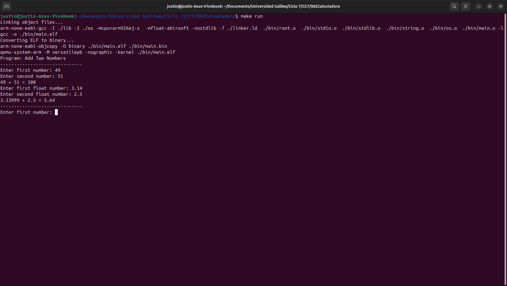

# Lab02 - Calculator
Operating System course's assingment which focuses on the architecture design for the OS development. Includes the implementation for PRINT and READ functions at low level development.
## Architecture design
The project is organized in a three layer design with the following structure:
```
Lab02-Calculator/
├── assets/        <- Images used for demonstration
├── bin/           <- Generated compiled files from Make
├── lib/           <- Library level 
├── os/            <- Operating Systems level
└── source/        <- User level
```
### User Level
Highest abstraction level where the application logic resides. Does not interact with the hardware level directly, instead uses the library layer to implement the high level functions.
```
└── source/
  └── main.c
```
### Library Level
Intermediate level that interacts with the OS Level to provide functionalities to facilitate higher level operations.
```
└── lib/
  ├── stdio.c       <- standard input/output operations
  ├── stdlib.c      <- number-string convertion functions
  └── string.c      <- string manipulation functions
```
### OS Level
Lowest level of the application where the communication with the hardware occures. Simplifies the hardware operations for the higher level uses.
```
└── os/
  ├── os.c          <- uart communication functions
  └── root.s
```
## Compiling and running
For compiling, running and debugging, execute the Makefile on the terminal. For more details, consult `make help`.
## Demonstration
The correct execution of the program shows the output of the arithmetic operations of the given numbers.
```
Program: Add Two Numbers
------------------------------
Enter first number: 49
Enter second number: 51
49 + 51 = 100 
Enter first float number: 3.14
Enter second float number: 2.5
3.13999 + 2.5 = 5.64 
------------------------------
```
